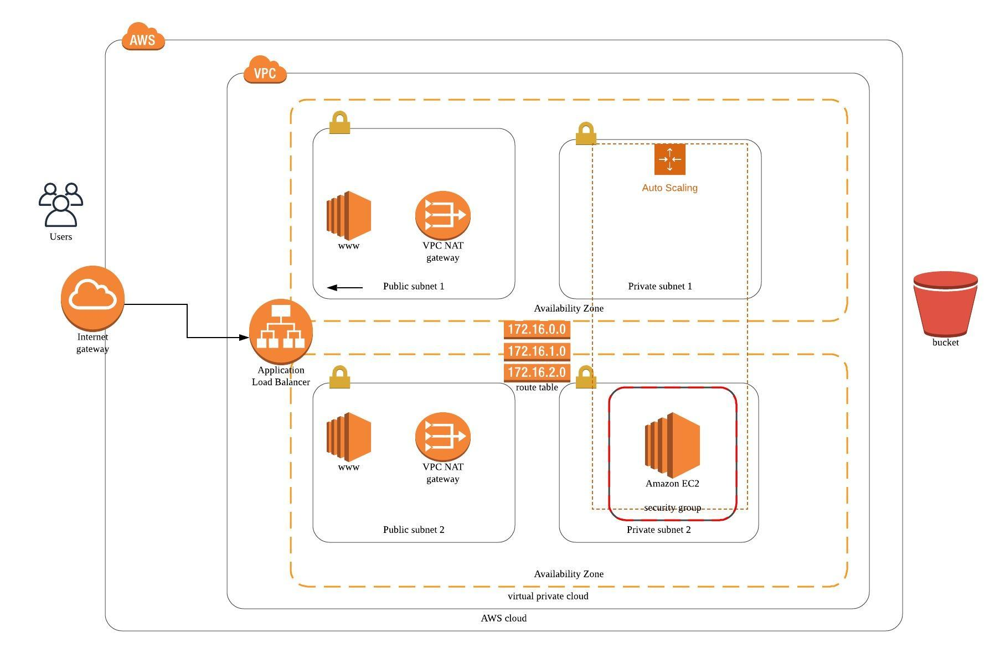

# Deploy_High_Availability_Web_App_Using_CloudFormation

I deployed web servers for a highly available web app using CloudFormation. I wrote the script that creates and deploys the infrastructure and application for an UdacityProject2HJX from the ground up. The script begin deploying the networking components followed by servers, security roles and software.

